# Enterprise IT Service Desk Simulation (Jira + Microsoft 365)

## Project Overview

This project simulates a real enterprise IT Service Desk environment using a cloud-based ticketing system.

The lab demonstrates how IT support teams manage incidents, investigate issues, communicate with users, perform root cause analysis, escalate technical problems, and document resolutions through a structured ticket lifecycle.

The simulated environment includes incidents related to Microsoft 365 authentication, endpoint compliance issues, and network printer outages.

---

## Technologies Used

• Jira Service Management (Ticketing System)
• Microsoft 365
• Microsoft Entra ID (Identity Management)
• Microsoft Intune (Endpoint Compliance Management)

---

## Key IT Support Concepts Demonstrated

Incident management
Ticket lifecycle management
Root cause analysis
Customer communication
Internal IT documentation
Service escalation workflow
Endpoint compliance troubleshooting
Microsoft 365 authentication troubleshooting
Network and printer troubleshooting

---

## Incident Scenarios Simulated

### 1. Microsoft 365 Login Failure

A user reported that they were unable to sign in to Microsoft 365 services.

Investigation revealed that the user account did not have a registered Multi-Factor Authentication (MFA) method. After configuring Microsoft Authenticator, the user was able to successfully log in.

This scenario demonstrates authentication troubleshooting and identity security configuration.

---

### 2. Endpoint Compliance Issue (Microsoft Intune)

A corporate laptop was flagged as non-compliant with company security policies.

The investigation identified that BitLocker disk encryption was not enabled, which violated the organization's endpoint compliance requirements.

The issue was escalated to the endpoint administration team, BitLocker encryption was enabled, and the device successfully reported as compliant.

---

### 3. Network Printer Outage

Users reported that the finance department network printer was not responding.

Troubleshooting revealed that a corrupted print job caused the print queue to stall. Clearing the queue and restarting the print spooler service restored printing functionality.

---

## Ticket Lifecycle Demonstrated

Each incident followed a structured IT service workflow:

User reports issue
↓
Helpdesk creates incident ticket
↓
Investigation and troubleshooting
↓
Root cause identification
↓
Escalation (when necessary)
↓
Resolution and service restoration
↓
Customer notification and ticket closure

---

## Screenshots

### Service Desk Dashboard

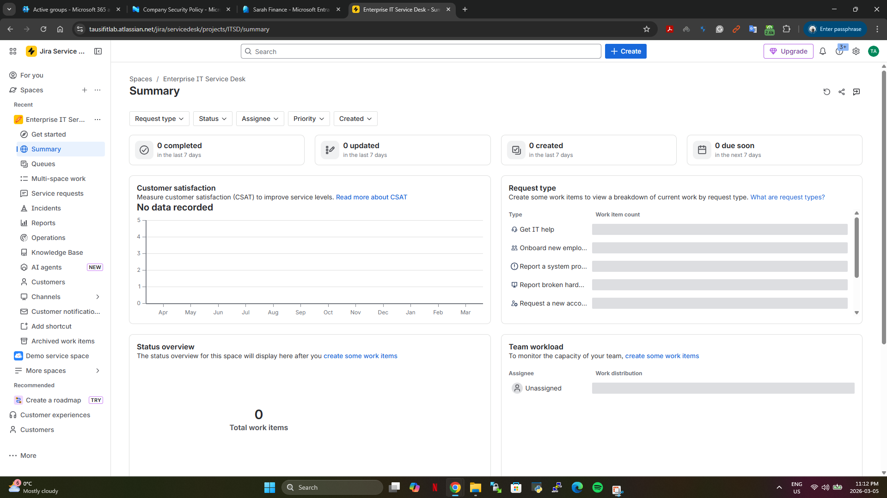

### Service Desk Portal

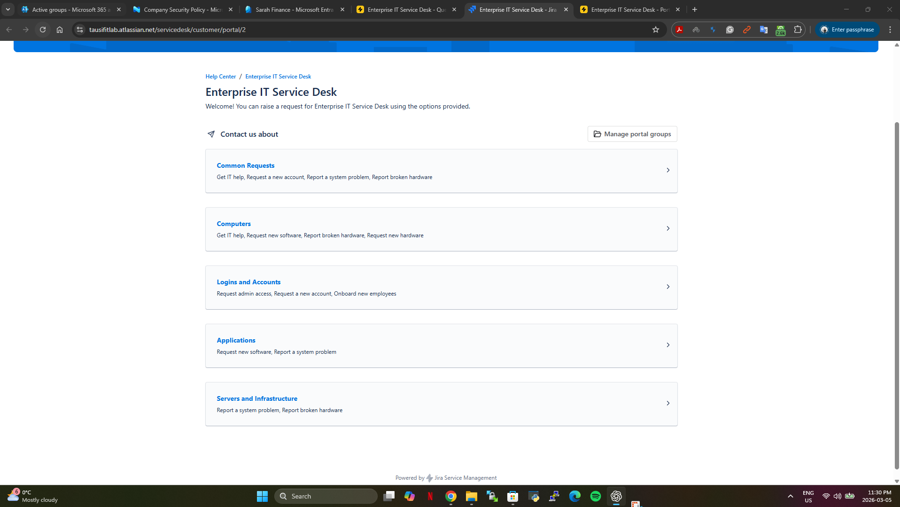

### Agent Queue Dashboard

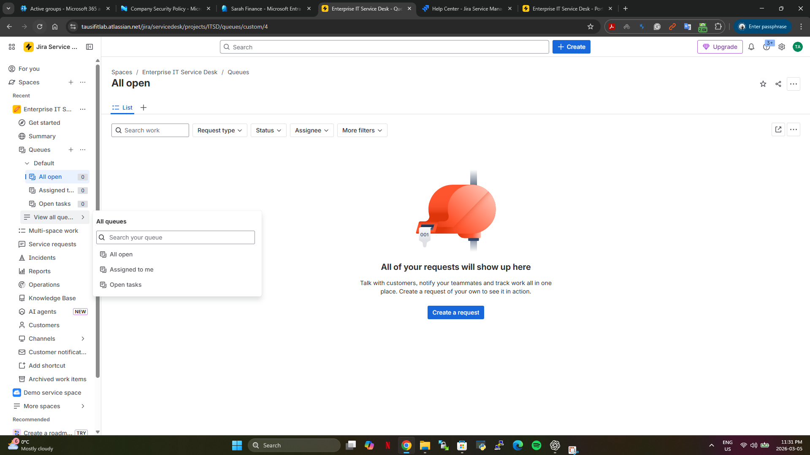

---

### Microsoft 365 Login Incident

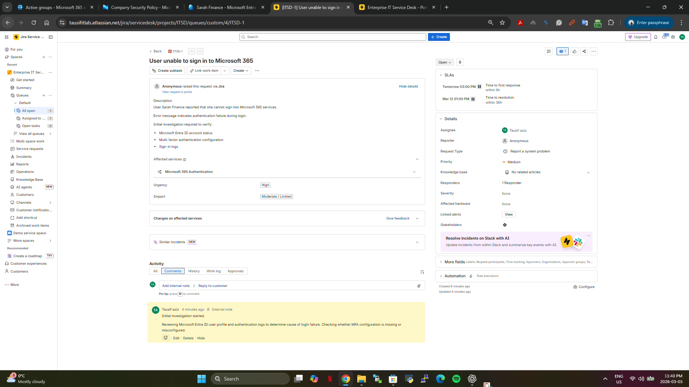

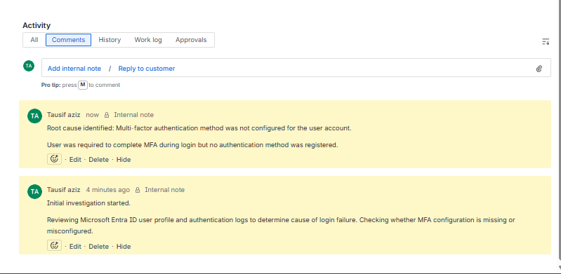

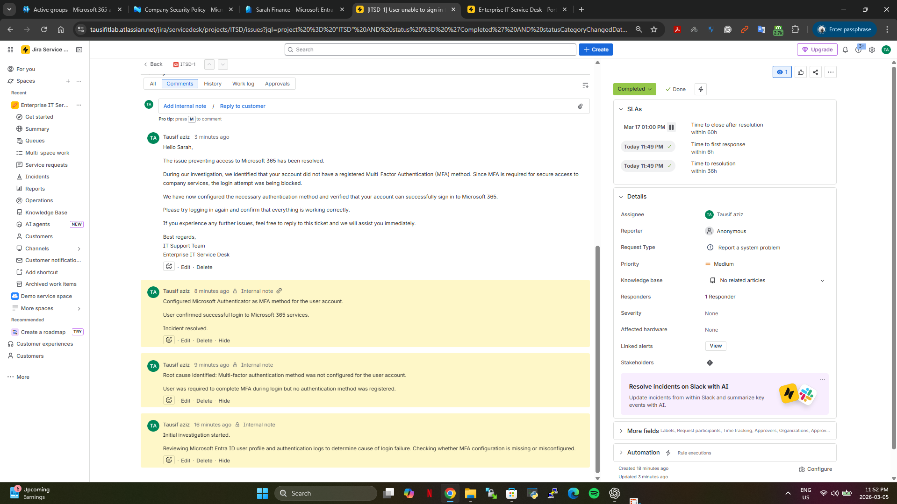

---

### Endpoint Compliance Incident

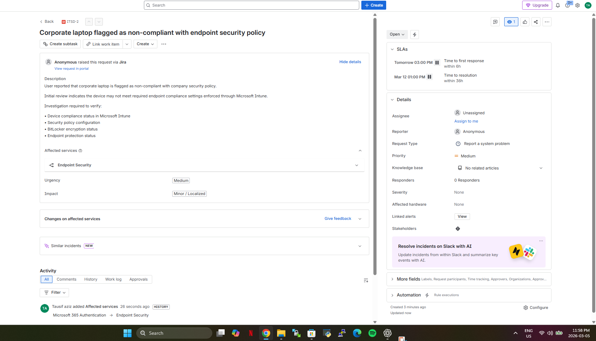

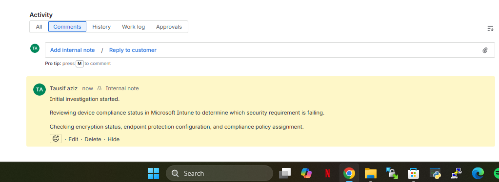

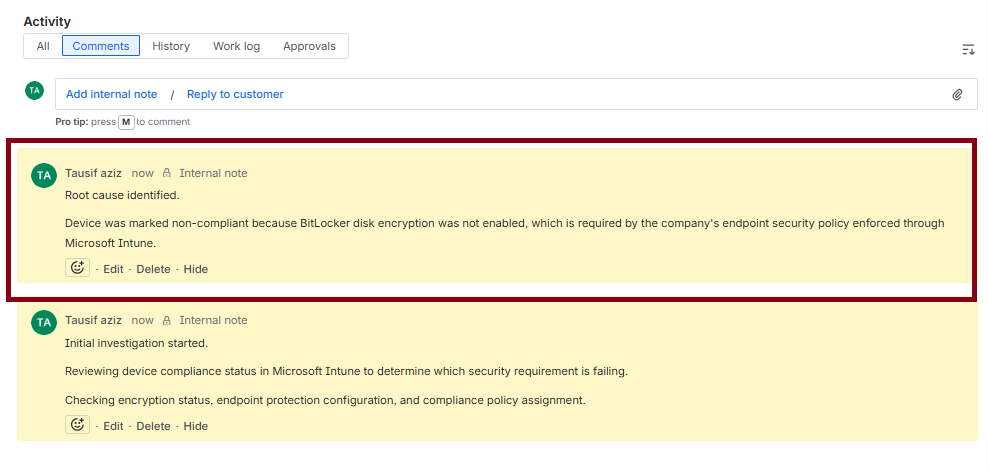

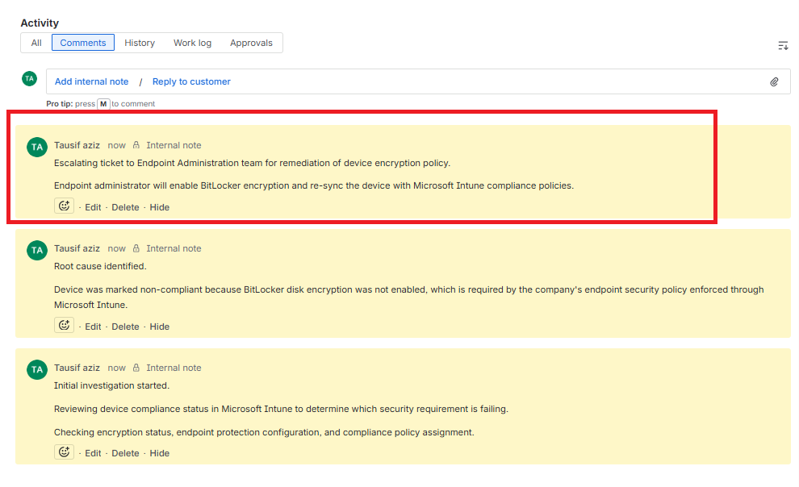

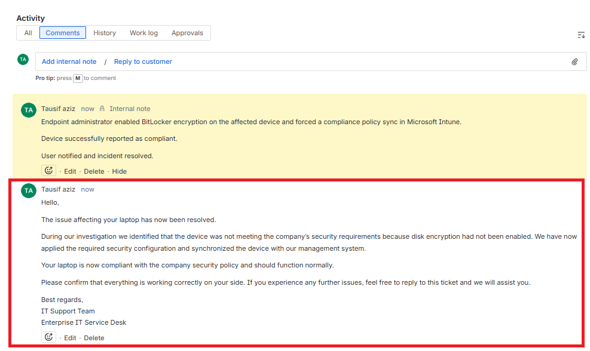

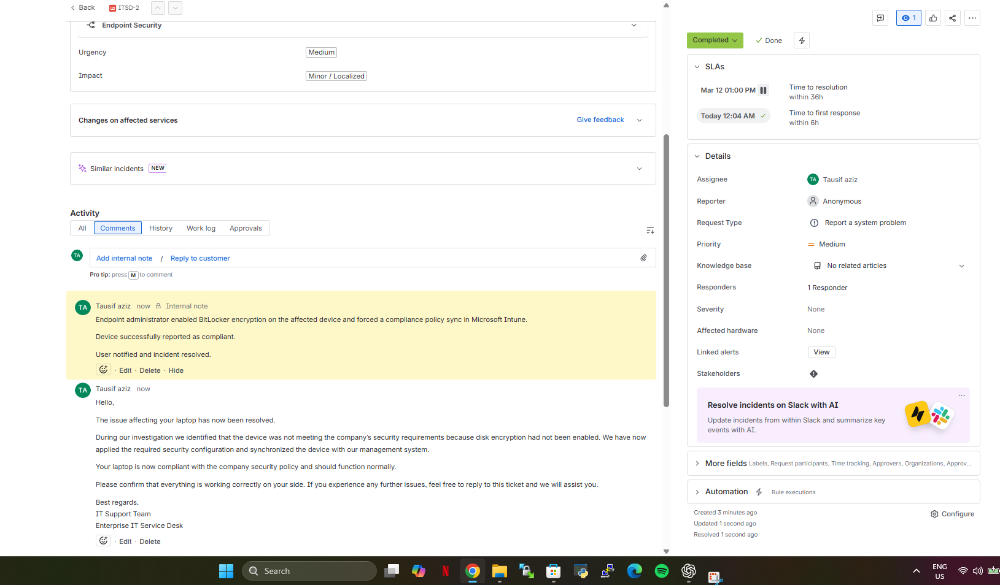

---

### Printer Outage Incident

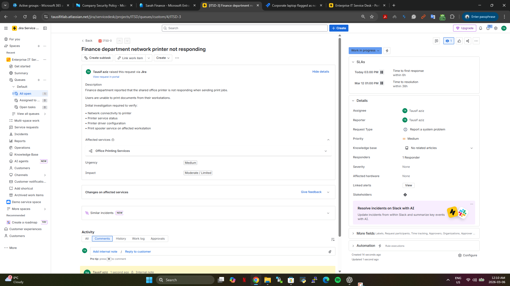

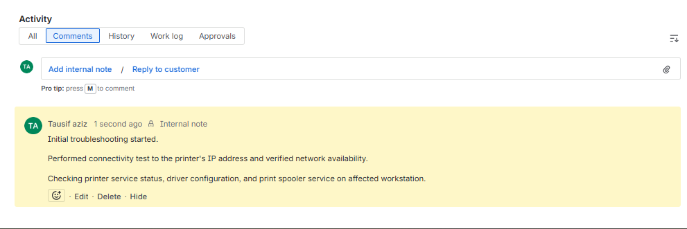

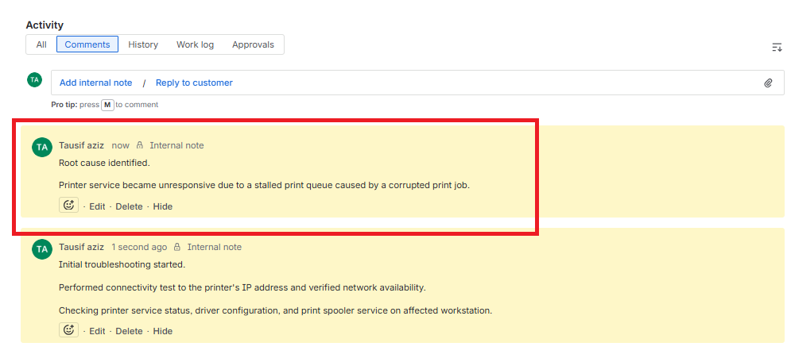

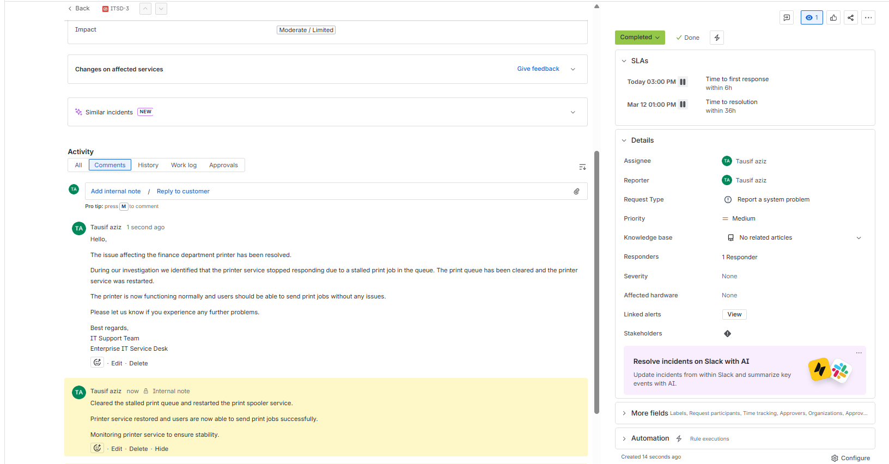

---

## Skills Demonstrated

IT Helpdesk Operations
Incident Management
Microsoft 365 Troubleshooting
Endpoint Security Compliance
Network Troubleshooting
Customer Communication
Technical Documentation

---

## Author

Tausif Bin Aziz
IT Support / Systems Administration Portfolio Project
